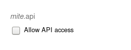
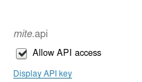

# mite-python

An idiomatic Python wrapper for the Mite API.

## Installation

`mite` can be obtained through pip:

```
pip install mite
```


## Prerequisites

You will need to create an API key. The API key will be created on the mite website. Login with your user and select "Account":


Now, you can select the "My Account" on the upper right of the website. 


On the page, a checkbox can be located with the text: "Allow API access". Click on the checkbox.




This will generate a key, it needs to be displayed. The key will be the `api key` parameter.



Once you have the generated the API Key you have to make sure to press the "Save" Button, otherwise the generated API toke won't work and you will get `mite.errors.Unauthorized: HTTP 401 Unauthorized` error message.

## Usage

All requests are encapsulated in a `Mite` object. To construct this object, you
need to supply it with an API key and a team name (your subdomain on Mite):

```python
from mite import Mite

mite = Mite("<team name","<api key>")
```

Then you can start requesting. Let’s get a list of time entries!

```python
print(mite.list_entries())
```

This will return a dictionary representing the JSON body of the response. If it
fails it will throw an exception that inherits from `mite.HttpException`, for
instance `mite.NotFound` for `404 Not Found` errors.

For a comprehensive list of functions, take a look at [the generated
documentation]().

<hr/>

Have fun!
